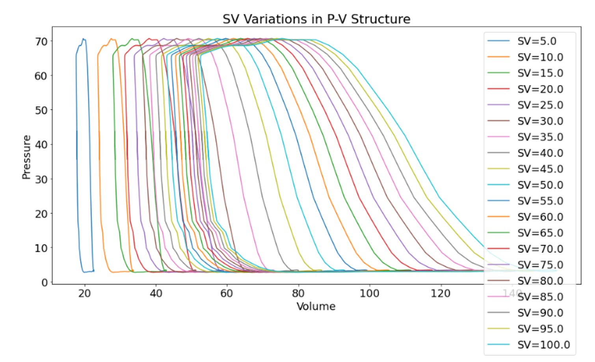

# Admittance-Based Left Ventricular Volume Reconstruction Project

## Overview

This repository contains our research aimed towards for **reconstructing left ventricular (LV) volume from admittance catheter measurements** and **evaluating the validity of the Wei equation which forms the foundation for the popular admittance model**.  

Our team collected **in vivo arterial and ventricular measurements** during an animal study, including:

- Raw **magnitude** and **phase** signals were obtained from the admittance catheter  
- Transonic ADV 500 device-calculated **LV volume waveform** (derived internally from the Wei model) generated from the magnitude and phase data.
- **Raw Ascending Aortic flow**  enabling accurate **heart rate (HR)** and **cardiac output (CO)** calculations from this waveform, allowing us to derive the **stroke version (SV)**

Our goal in this project is to **recreate the LV volume waveform** directly from raw conductance data, **verify** how closely it matches the device-derived signal, and then **develop improved physiologically-grounded models** for converting admittance signals into ventricular volume.

---

## Background: The Admittance Model

Admittance catheter systems model the electrical field within the left ventricle by assuming:

- **Blood** behaves as a *pure resistor*
- **Myocardium** behaves as a *resistor + capacitor*  
- The measured admittance is the sum of contributions from blood and myocardial tissue

Unlike the simpler conductance model, the admittance formulation attempts to account for time-varying muscle properties by using both **magnitude** and **phase** of the measured signal.

---

## Wei Equation for LV Volume

The Wei model expresses instantaneous LV volume as:

V(t) = (1 / (1 - G_b(t) / γ)) * ρ * L^2 * G_b(t)

Where:

| Symbol | Meaning |
|--------|---------|
| \( \rho \) | Blood resistivity |
| \( L \) | Electrode spacing |
| \( G_b(t) \) | Instantaneous blood conductance |
| \( \gamma \) | Field correction factor |

The correction factor \( \gamma \) is derived from the quadratic:

γ = (-b ± sqrt(b^2 - 4ac)) / (2a)

with terms:

a = SV - ρ * L^2 * (G_b,ED - G_b,ES)
b = -SV * (G_b,ED + G_b,ES)
c = SV * G_b,ED * G_b,ES

Where:

- G_b,ED : blood conductance at end-diastole  
- G_b,ES : blood conductance at end-systole  
- SV : stroke volume

### Unique Advantage of Our Dataset

Wei’s original formulation requires **estimated** stroke volume (often from thermodilution or assumed CO).  
Our study recorded **direct aortic flow**, allowing:

- Precise cardiac output (via flow integration)  
- Heart rate (via sampling rate × samples per cycle)  
- **True stroke volume**, not an estimate  

This enables unusually high-fidelity testing of the Wei equation’s validity.

---

## Project Goals

### 1. Reconstruct LV Volume From Raw Magnitude + Phase
- Recover instantaneous blood conductance \(G_b(t)\)  
- Apply the Wei equation  

### 2. Compare Against the Device-Derived Volume
- Beat-to-beat alignment of SV values  
- Residual analysis  
- Study the volme sensitivity to \( \gamma \), \( \rho \), and \(L\)

### 3. Identify Inconsistencies in the Wei Model
Potential issues (suggested by ChatGPT) can include:

- Capacitive myocardial modeling assumptions  
- Fixed resistivity  
- High sensitivity to conductance noise  
- Linear mapping between \(G_b\) and volume

### 4. Develop Improved Admittance-to-Volume Equations
Planned directions:

- New or modified field correction factors  
- Physics-informed models of myocardial capacitance  
- Machine-learning enhancements  
- Hybrid physics + data approaches  

All models will be validated against true stroke volume.

---

## Repository Structure

- To be determined 

---

## Scientific Workflow

1. Import raw catheter signals  
2. Detect ED and ES to the magnitude  
3. Compute true stroke volume  
4. Solve Wei quadratic and reconstruct LV volume  
5. Compare generated model with device-calculated volume  
6. Iterate with improved models

---

## Why This Project Matters

Although the admittance model is widely used, its assumptions have not been rigorously validated with:

- True stroke volume from direct flow  
- Raw complex admittance data  
- Transparent reconstruction of every computational step  

This repository serves as the first open testbed (to our knowledge) for analyzing:

- Physical correctness of Wei’s formulation  
- Stability of the correction factor \( \gamma \)  
- Error propagation into stroke volume and PV loop geometry  
- More accurate alternative models

---

## Contributors
- **Dr. Elaheh Rahbar** - PI
- **Fahim Mobin** — PhD Candidate  
- **Kellen Jones** — BMEN Intern

## ChatGPT Recommended Repository Structure
/data_raw/ Raw magnitude, phase, and flow recordings
/data_processed/ Cleaned signals, cardiac cycle segmentation
/notebooks/ Jupyter notebooks for replication and analysis
/src/
admittance/ Signal processing + G_b calculation
wei_model/ Wei equation reconstruction
validation/ Comparison to device LV volume
ML_models/ Exploratory machine learning alternatives
/results/ Plots, metrics, model comparisons
/docs/ Additional documentation